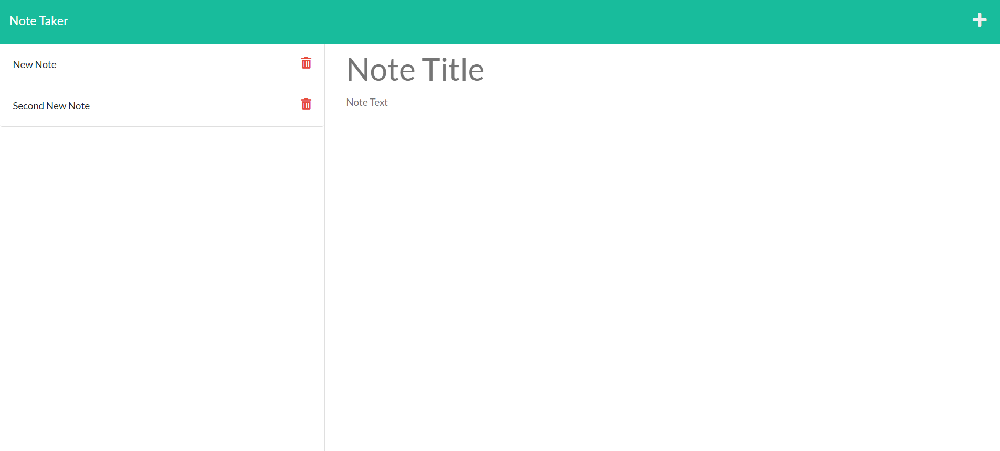

# Note Taker with Express.js

## Description

This is a simple note taking application using a server with Express.js. You can read notes, add notes, and delete notes.

---

## Installation

There is no need for installation, just visit the webpage at this [link](https://aqueous-hamlet-69728.herokuapp.com/).

## Usage

When you arrive at the landing page, click the button to begin note-taking. In the right-hand column you can add your title and text. Both are required in order to save the note. When you are satisfied with your note, you can press the save button on the top right corner. The new note will appear on the left hand column. You can click the note to read it, or you can click the trash icon to delete it. If you want to add a new note, you can press the plus sign at the top right to start a new note.

## Questions

Check out the repository on [GitHub](https://github.com/ariellongoria/note-taker).
